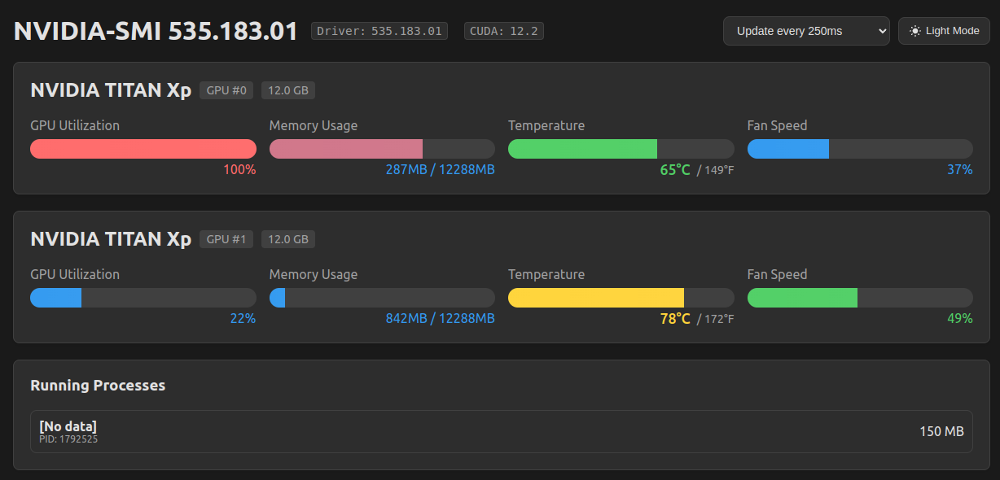
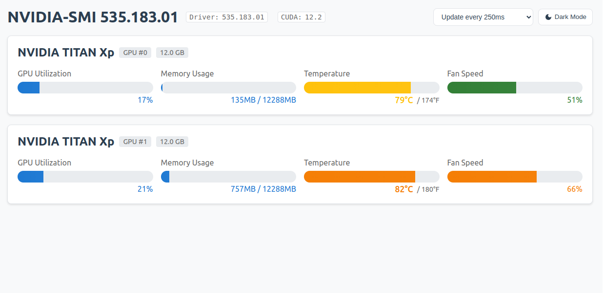
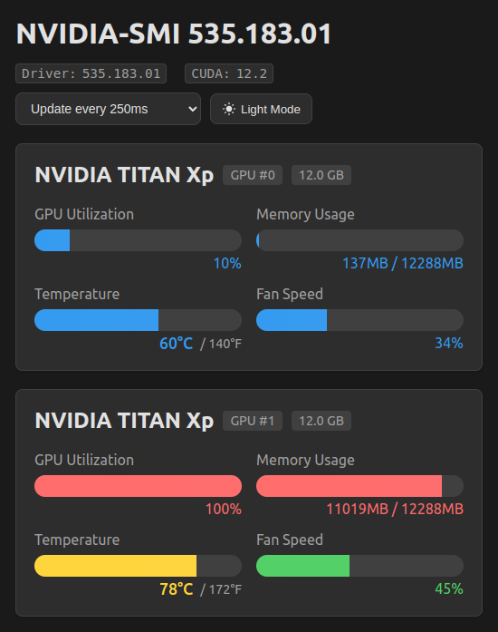

# NVIDIA GPU Performance Monitor

<p align="center">
  
</p>

Real-time NVIDIA GPU monitoring in your browser. Color-coded metrics, temperature trends, and process tracking — no more squinting at `nvidia-smi` output while your model trains.

---

## Features

- **Live metrics** — utilization, memory, temperature, fan speed, power draw, updated as fast as 250 ms
- **Color-coded severity** — instantly know if a value needs attention without reading numbers
- **Temperature trends** — rising/falling indicators with °C/min rate
- **Peak tracking** — high-water marks per GPU, resettable on demand
- **GPU burn detection** — automatic stress-test monitoring with error counting
- **Process list** — which processes are consuming GPU memory and how much
- **Dark / light mode** — persisted across sessions
- **Responsive layout** — works on mobile

## Screenshots

| Stress test (dark) | ML workload | Mobile |
|---|---|---|
|  |  |  |

## Tech stack

| Layer | Technology |
|---|---|
| Frontend | React 18.3, TypeScript 5.5, Vite 5 |
| Backend | FastAPI, pynvml, uvicorn |
| GPU access | pynvml (direct NVIDIA driver — no subprocess) |
| System tools | nvidia-smi, CUDA Toolkit, gpu-burn (optional) |

## Requirements

- NVIDIA GPU with drivers installed
- Python 3.8+
- Node.js 18+

## Installation

```bash
git clone https://github.com/jackccrawford/nvidia-gpu-perf-monitor.git
cd nvidia-gpu-perf-monitor
```

**Backend**

```bash
cd backend
pip install -r requirements.txt
```

**Frontend**

```bash
cd frontend
npm install
```

## Running

```bash
# From the project root — starts both services cleanly
./restart.sh
```

Then open **http://localhost:5173** in your browser.

| Service | URL |
|---|---|
| Dashboard | http://localhost:5173 |
| API | http://localhost:5000/api/gpu-stats |
| API docs | http://localhost:5000/docs |

To stop everything:

```bash
./stop_servers.sh
```

<details>
<summary>Manual startup (if needed)</summary>

```bash
# Terminal 1 — backend
cd backend
python gpu_service.py

# Terminal 2 — frontend
cd frontend
npm run dev
```

</details>

## Color reference

Thresholds apply to temperature, utilization, memory, and fan speed (with slightly different breakpoints for each).

| Color | Temperature | Utilization |
|---|---|---|
| 🔴 Red | ≥ 80 °C | ≥ 90% |
| 🟠 Orange | ≥ 70 °C | ≥ 75% |
| 🟡 Yellow | ≥ 60 °C | ≥ 50% |
| 🟢 Green | ≥ 50 °C | ≥ 25% |
| 🔵 Blue | < 50 °C | < 25% |

## API

```
GET  /api/gpu-stats    — current metrics for all GPUs
POST /api/reset-peaks  — reset peak temperature records
```

Interactive docs available at `http://localhost:5000/docs` (FastAPI built-in).

## Stress testing

```bash
./gpu-burn 60   # 60-second stress test
```

The dashboard automatically detects `gpu-burn` processes and shows a burn panel with elapsed time and error count.

> **Warning** — do not run stress tests for extended periods. Monitor temperatures closely and stop if you approach thermal limits.

## Security

This tool is intended for local / LAN use only. It does not collect or transmit any data externally. No authentication is configured by default.

## License

MIT — see [LICENSE](LICENSE).

---

<p align="center">Made for the GPU community</p>
