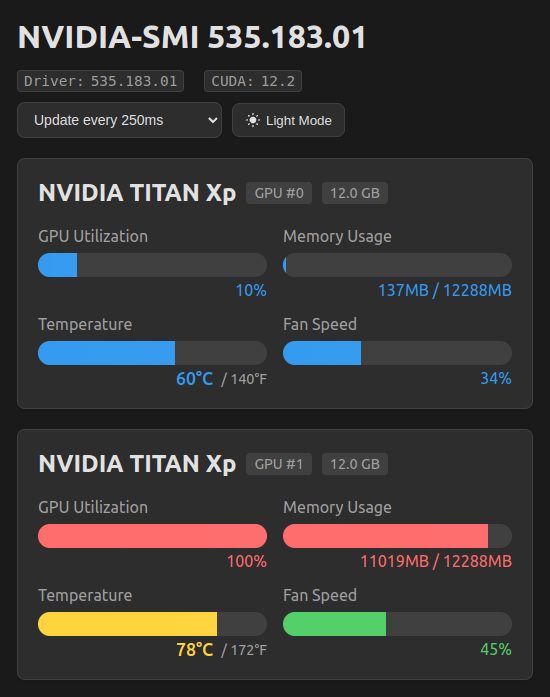

# 🎮 NVIDIA GPU Performance Monitor

> "Information should not be displayed all at once; let people gradually become familiar with it." - Edward Tufte

Tired of playing "Find the Important Number" in your terminal while your ML model trains? Watching your GPU temperature shouldn't feel like decoding the Matrix. 

Do you find yourself:
- 👀 Constantly switching between terminal windows?
- 🔍 Squinting at rapidly changing numbers?
- 🤯 Missing critical spikes in GPU usage?
- 🌡️ Wondering if that temperature is actually concerning?
- 💭 Spending mental energy parsing dense data when you should be focusing on your work?

We've reimagined GPU monitoring with human-centered design principles. Instead of parsing dense terminal output, our dashboard leverages intuitive visual affordances - color gradients that immediately signal temperature states, progress bars that show memory usage at a glance, and trend indicators that make pattern recognition effortless.

This beautiful, real-time GPU monitoring dashboard transforms complex metrics into an intuitive interface. Built with React and Flask, it reduces cognitive load through thoughtful information hierarchy and visual signifiers, letting you focus on your work while maintaining awareness of your GPU's health.


*Transform complex GPU metrics into intuitive visual patterns*

Key Design Principles:
- Reduced Cognitive Load: Visual patterns over dense numbers
- Intuitive Signifiers: Color-coding that maps to severity levels
- Information Hierarchy: Critical metrics prominently displayed
- Pattern Recognition: Trend visualization for quick analysis
- Attention Management: Alerts that demand attention only when needed


## 🔄 From Terminal to Visual Intelligence

### 📊 The Old Way: Dense Terminal Output

*Traditional nvidia-smi command line output - dense numbers requiring constant cognitive processing*

### 📈 Real-world Usage Examples

#### 🤖 Machine Learning Workload Monitoring

*Dashboard showing Ollama running the Mistral-Small model - clear resource utilization*

#### 🔥 Stress Test Monitoring

*Intensive GPU stress testing with gpu-burn - immediate visual alerts*

#### 📱 Mobile-Optimized View


*Responsive design automatically adapts to any screen size*

## 🛠️ Tech Stack

- **📊 Frontend**: React 18, TypeScript, Vite
- **📈 Backend**: Python, Flask
- **🔧 System Tools**:
  - nvidia-smi
  - gpu-burn
  - CUDA Toolkit

## 📦 Installation

1. Clone the repository:
   ```bash
   git clone https://github.com/yourusername/nvidia-gpu-monitor.git
   ```

2. Install backend dependencies:
   ```bash
   cd backend
   pip install -r requirements.txt
   ```

3. Install frontend dependencies:
   ```bash
   cd frontend
   npm install
   ```

4. Start the backend server:
   ```bash
   cd backend
   python gpu_service.py
   ```

5. Start development server:
   ```bash
   cd frontend
   npm run dev
   ```

## 🎯 Usage Examples

### 🔍 Monitoring Machine Learning Workloads
```python
# Run your ML training
python train.py --model large --epochs 100
```
Monitor in real-time:
- GPU utilization during training
- Memory consumption patterns
- Temperature trends
- Process-specific metrics

### 🔥 Stress Testing
```bash
# Run gpu-burn
./gpu-burn 60  # 1 minute stress test - watch closely!
```
Monitor in dashboard:
- Temperature peaks
- Error detection
- Duration tracking
- Performance metrics

 ⚠️ **CAUTION**: Never run stress tests for extended periods. This can damage your GPU!

## 🌡️ Temperature Monitoring

Color-coded temperature ranges for intuitive monitoring:
- 🔴 Red (≥85°C): Danger zone
- 🟠 Orange (80-84°C): Warning
- 🟡 Yellow (70-79°C): Normal gaming temp
- 💚 Green (65-69°C): Ideal temperature
- 💙 Blue (50-64°C): Cool
- 🟦 Indigo (<50°C): Very cool

## 🔒 Security Notes

- No sensitive data collection
- Local-only operation
- Process information filtered
- Safe subprocess execution
- Error handling for all operations

## 📝 License

This project is licensed under the MIT License - see the [LICENSE](LICENSE) file for details.

## 🙏 Acknowledgments

- NVIDIA for nvidia-smi toolkit
- [gpu-burn](https://github.com/wilicc/gpu-burn) for stress testing
- [React](https://reactjs.org) for frontend framework
- [Flask](https://flask.palletsprojects.com) for backend framework
- Icons by [Heroicons](https://heroicons.com) and [Phosphor](https://phosphoricons.com)

---

<p align="center">Made with ❤️ for the GPU community</p>
<p align="center">Developed with assistance by <a href="https://www.codeium.com">Codeium</a> Windsurf</p>
